# gaya-pixel-style-sampler

**Nano Banana 2 (Gemini 3.1 Flash Image Preview)** 로 동일 캐릭터 (가야) 를 8개 픽셀 그림체로 변주한 샘플북.
프로젝트: [가야의 연결점](https://github.com/dalsoop) · VN+탑다운 로그라이트 하이브리드.

## 왜 만들었나

"pixel art" 단독 프롬프트로는 Nano Banana 가 **애니 일러스트에 계단 현상 씌운 결과** 만 내놓음. 진짜 픽셀 게임 룩 (Vampire Survivors · Chrono Trigger · Stardew Valley 같은) 을 내려면 **구체 그림체 키워드 + 팔레트 제약 + 치비 비율 + 얼굴 단순화** 를 다중 명시해야 함.

이 레포는 **8 그림체 x 동일 캐릭터** 로 뭐가 먹히고 안 먹히는지 실험한 결과.

---

## 샘플 비교

| # | 스타일 | 결과물 |
|---|---|---|
| 01 | Vampire Survivors (Antonio chunky 24×24) | 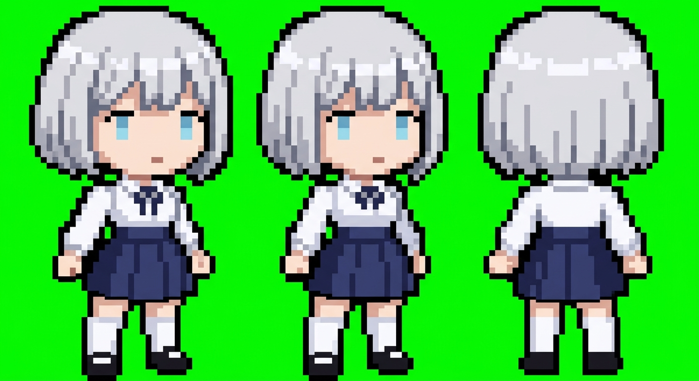 |
| 02 | Chrono Trigger (Toriyama chibi JRPG) | 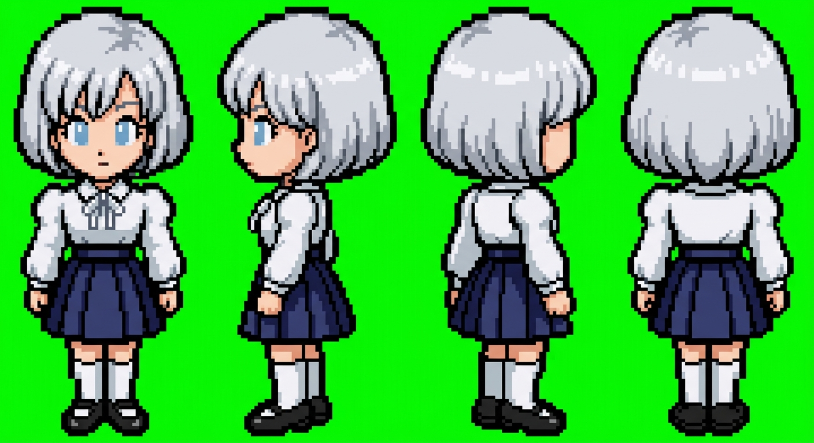 |
| 03 | Castlevania SOTN (Gothic 16-bit) | 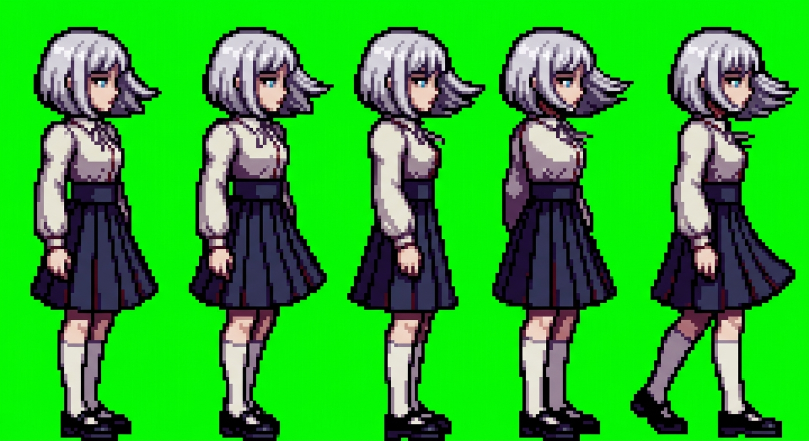 |
| 04 | Stardew Valley (ConcernedApe 팜) | 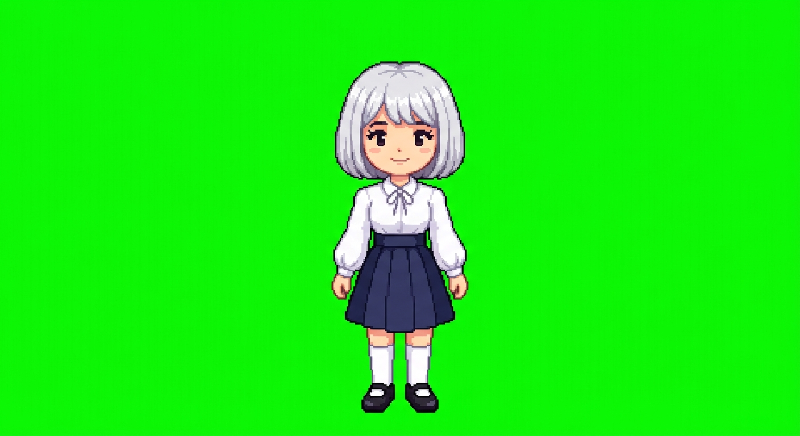 |
| 05 | PICO-8 (16색 극미니) | 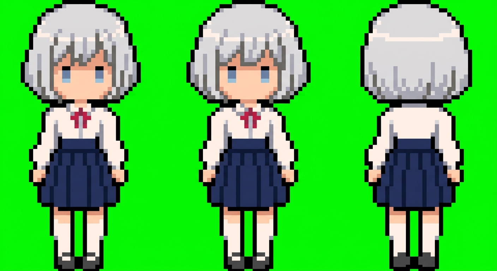 |
| 06 | Archero (3D-ish 3/4 뷰) | 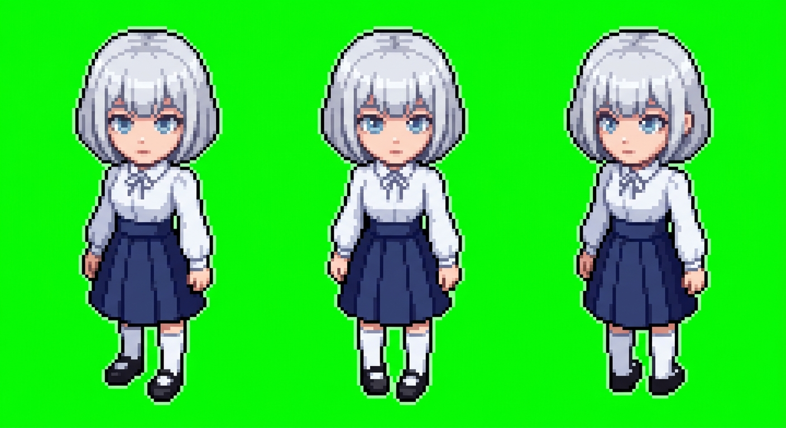 |
| 07 | Hyper Light Drifter (네온 사이버펑크) | 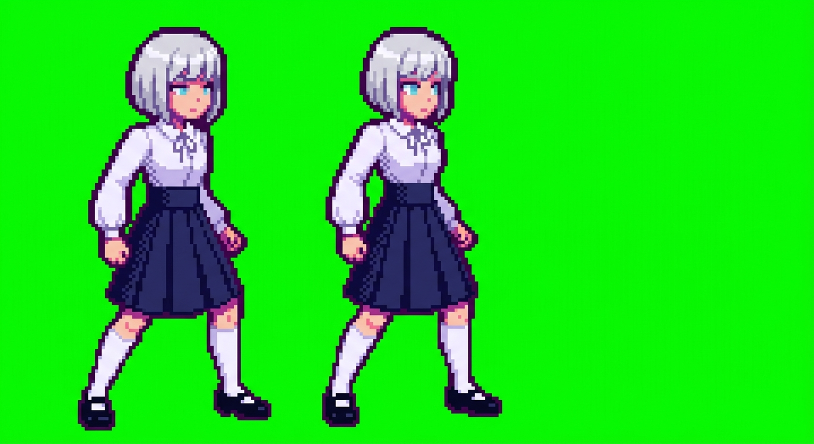 |
| 08 | Seiken Densetsu 3 (SNES SquareSoft) | 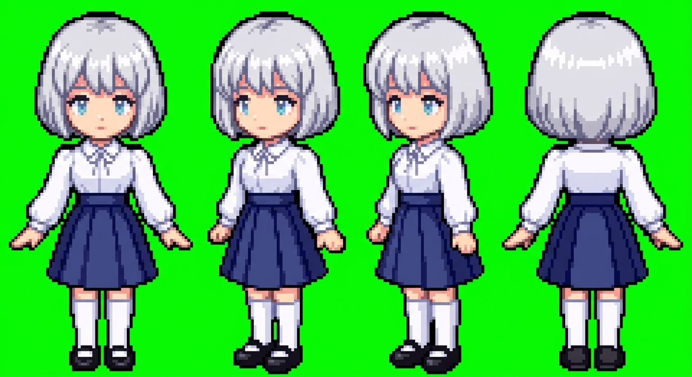 |

각 폴더 `styles/<name>/`:
- `prompt.txt` — 실제 Nano 에 보낸 프롬프트 전문
- `result.png` — Nano 출력물 원본 (후처리 없음)

---

## 공통 캐릭터 설정 (가야)

```
short silver-white bob with layered bangs
bright pale blue eyes, gentle calm gaze
fair pale skin
slender teenage girl, 160cm, 17 years old
white long-sleeve blouse + ribbon tie collar
high-waisted navy pleated skirt, knee length
white knee-high socks + black mary jane shoes
```

## 공통 네거티브 프롬프트

```
no anti-aliasing, no smooth gradients, no blur,
not anime illustration, not digital painting, not concept art,
no soft shading, no photorealism, no 3D render look,
no text, no labels, no watermark, no logo, no grid lines,
no multiple characters, only one single character.
```

---

## 우리 프로젝트 실사용 결과물 (`ours/`)

실제 가야 캐릭터 파이프라인으로 생성한 에셋들:

| 자산 | 파일 |
|---|---|
| 원본 업로드 모델시트 (4뷰) |  |
| Pixel Base Sprite | 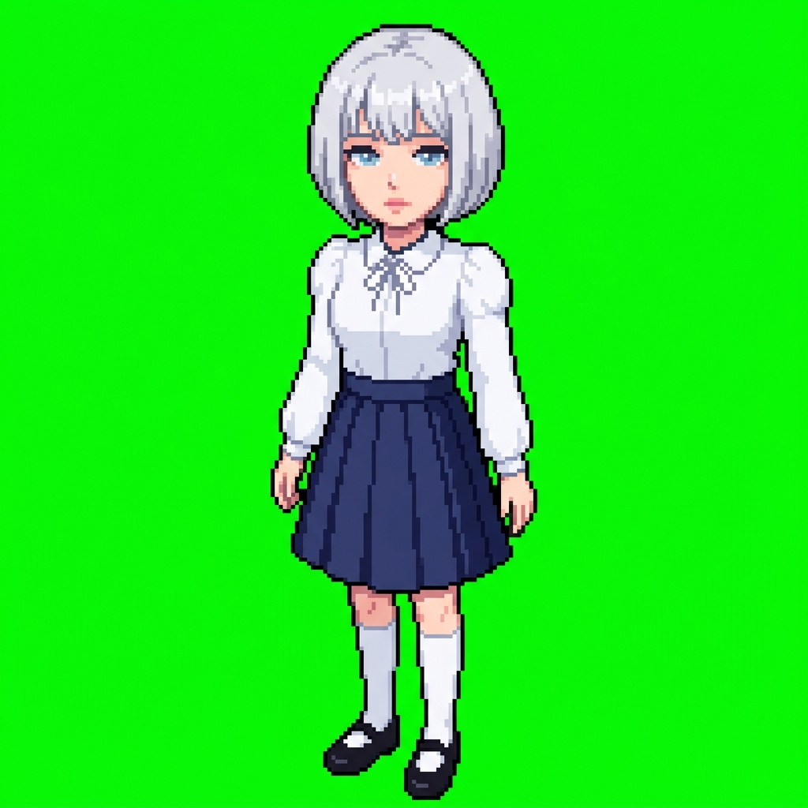 |
| Walk Sheet (4×2, 8 frames, 측면) | 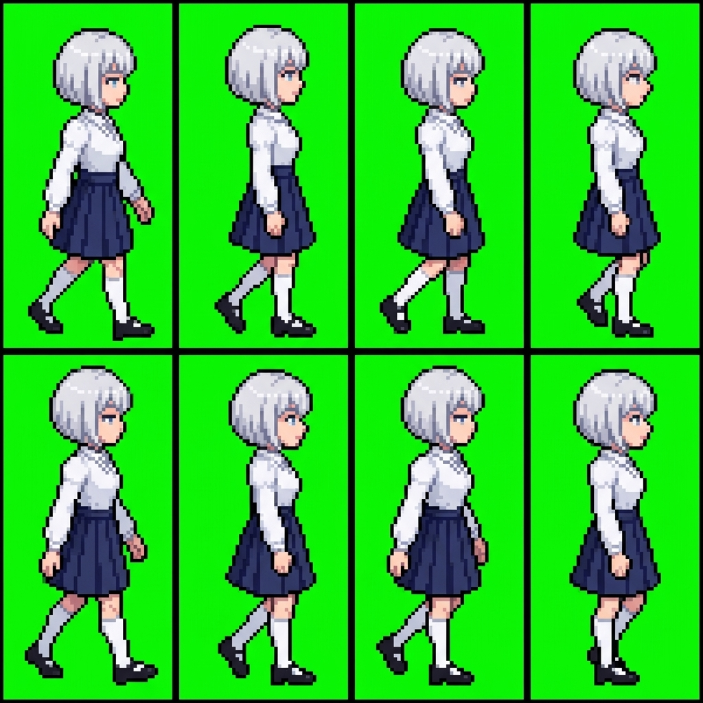 |
| Walk GIF (rembg 처리) | 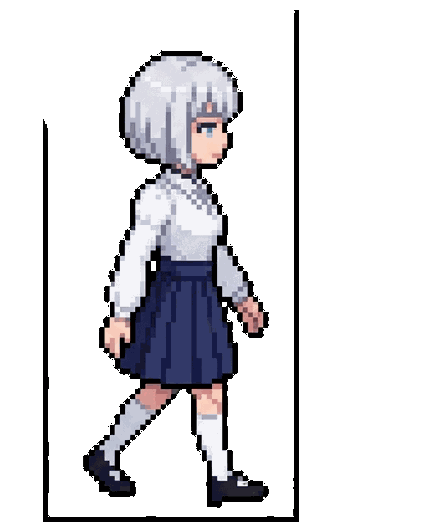 |
| Idle Sheet (1×4) | 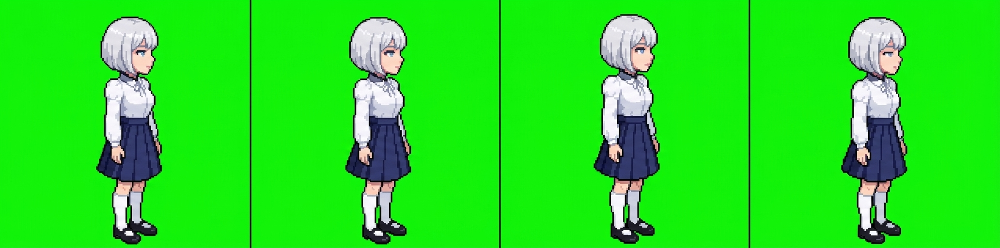 |
| Attack Sheet (3×2, 6 frames) | 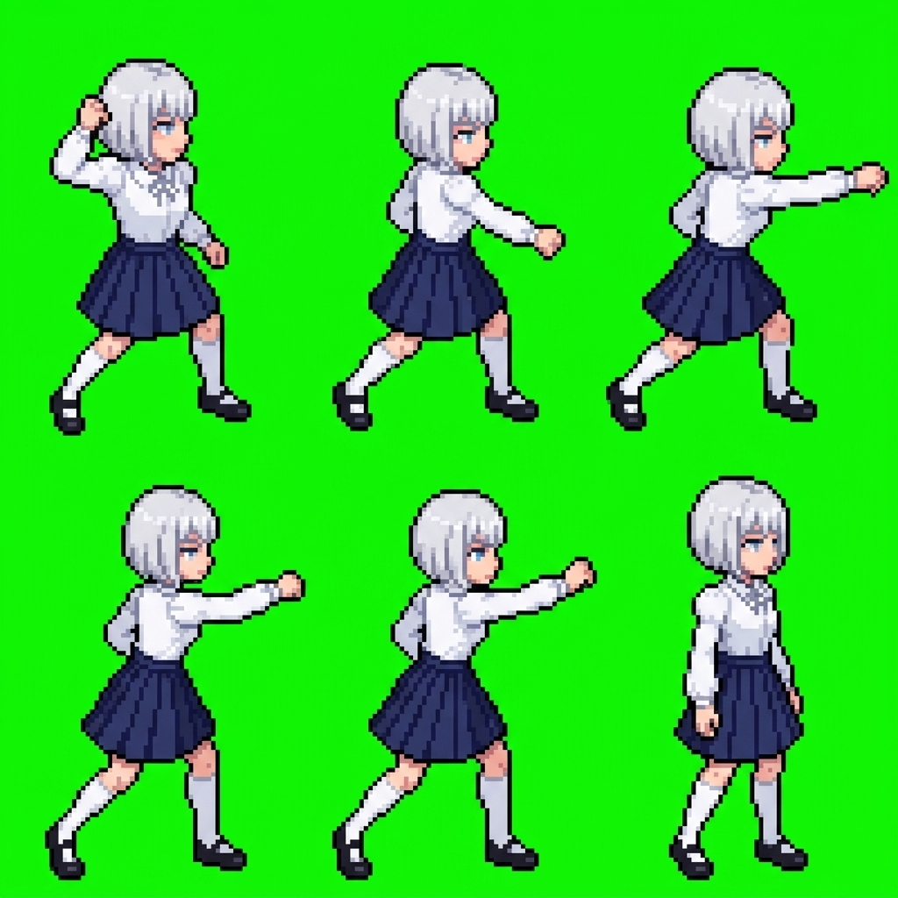 |

`ours/` 자산들의 문제점:
- **얼굴 디테일 과다** — 픽셀에서 뭉개짐
- **6등신** — 뱀파이어 서바이벌 같은 진짜 VS 룩 아님
- **그라데이션 셰이딩** — 진짜 픽셀 아님
- **애니풍 치우침** — "pixel art" 만으로는 Nano 가 애니 일러스트를 픽셀화한 듯한 결과

→ 이 샘플북의 `styles/` 폴더들이 위 문제 해결 실험.

---

## 핵심 교훈

### 1. "pixel art" 만으로는 부족

❌ 나쁨: `pixel art character, pixel style`
✅ 좋음: `16-bit SNES-era pixel art, Chrono Trigger style, 2-head-tall chibi, dot eyes, flat colors with 2-tone cel shading, no gradients, bold 2px black outline, pure flat #00FF00 background`

### 2. 게임 제목 레퍼런스가 가장 강력

`Castlevania SOTN`, `Chrono Trigger`, `Vampire Survivors`, `Stardew Valley` 같은 **구체 게임 이름** 이 "pixel art" 추상어보다 훨씬 강한 컨텍스트.

### 3. 팔레트 제약 숫자화

- `8-color limited palette`
- `strict PICO-8 16-color palette only`
- `15-bit SNES palette`

숫자 명시가 그라데이션 방지에 효과적.

### 4. 얼굴 단순화 강제

`dot eyes 1-2 pixels, single pixel mouth, simplified face` — 얼굴이 뭉개지는 것 막는 유일한 방법.

### 5. 배경 고정

`pure flat chroma key green #00FF00 background, EXACT hex, no gradients no noise no texture` — Nano 는 알파 못 뱉으므로 녹색 고정 → 후처리 (chromakey or rembg).

### 6. 치비 비율 숫자화

- `2-head-tall chibi` (Vampire Survivors)
- `3-head-tall semi-chibi` (Stardew Valley / Archero)
- 그냥 "chibi" 만 쓰면 5~6 등신도 나옴

---

## 네거티브 프롬프트가 작동하는가?

Nano Banana 는 **explicit negative parameter 가 없음**. 자연어 네거티브 문장을 positive prompt 끝에 붙이는 방식. 효과는 제한적:

| 네거티브 구문 | 효과 |
|---|---|
| `no anti-aliasing` | ✅ 어느 정도 먹음 |
| `no text, no letters` | ✅ 잘 먹음 |
| `not anime illustration` | ❌ 거의 안 먹음 (다른 긍정 키워드로 덮어야 함) |
| `no soft shading` | 🟡 팔레트 제약이 더 효과적 |

---

## 참조 링크

- [Generating Game Sprites with Gemini Image Generation — roboticape.com](https://roboticape.com/2026/03/07/generating-game-sprites-with-gemini-image-generation-nano-banana-pro-lessons-learned/)
- [Nano-Banana Pro Prompting Guide — dev.to/googleai](https://dev.to/googleai/nano-banana-pro-prompting-guide-strategies-1h9n)
- [Practical Workflow for AI Pixel Art: Gemini 2D Animation — dev.to/kenjidev9662](https://dev.to/kenjidev9662/practical-workflow-for-ai-pixel-art-gemini-2d-animation-experiment-21le)
- [5 Essential Game Asset Prompt Strategies — nanoprompts.org](https://nanoprompts.org/lab/2025/game-asset-design-guide)
- [nano-banana-2-skill CLI — github.com/kingbootoshi](https://github.com/kingbootoshi/nano-banana-2-skill)

---

## 라이센스

결과 이미지는 CC0 (연구·교육용 실험). 프로젝트 설정 (가야 캐릭터 설정) 은 저작자 소유.

생성일: 2026-04-22
