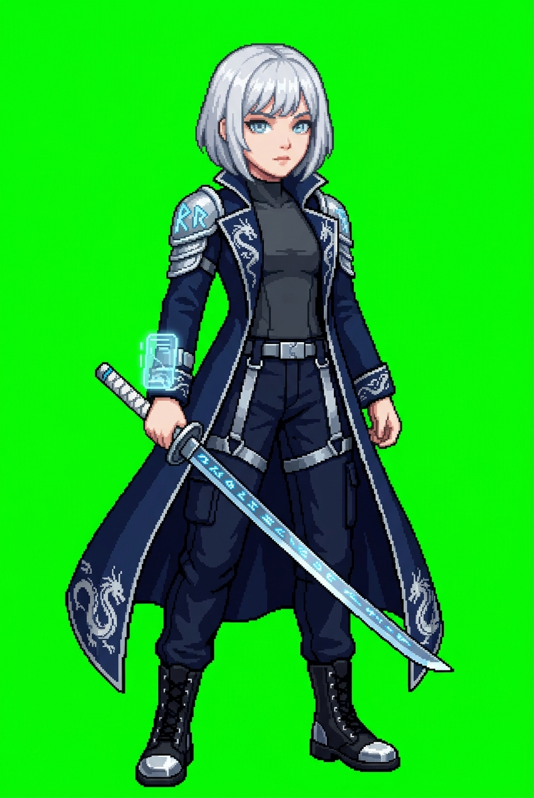
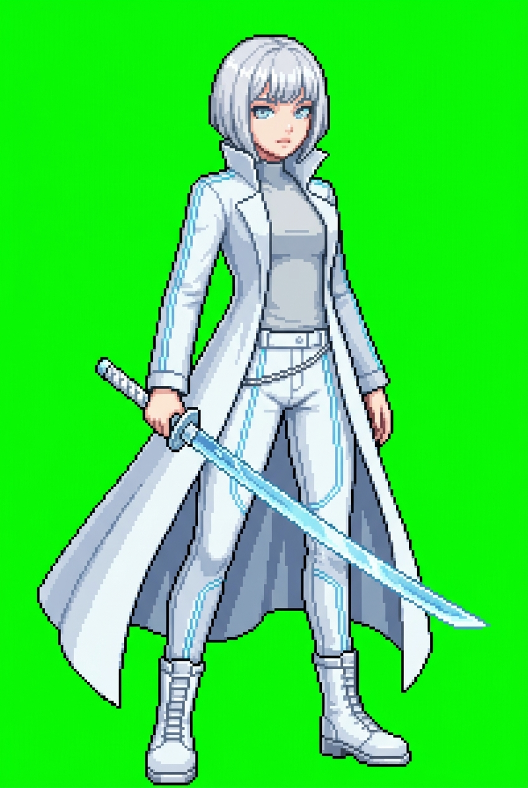
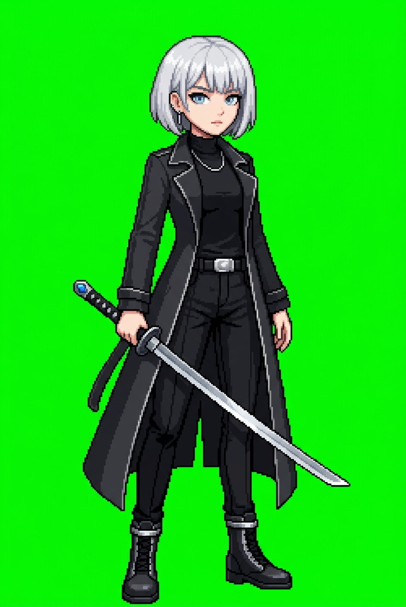

# 전투용 의상 변주 (가야 캐논 색상 매칭)

기존 사이버펑크 8종이 색상 발산형 (네온/강렬색) 이었다면, 이 폴더는 **가야 캐논 (은발·파란눈·페일스킨)** 과 조화되는 색상 팔레트만 사용.

공통 사양:
- 4.5등신 slim semi-realistic (치비 탈피, 성인 비율)
- 머리가 몸에 비례해서 작아짐
- 전투 자세 (카타나 파지)
- 색상: 네이비·블랙·화이트·실버·아이스블루 (은발과 조화)

| # | 이름 | 미리보기 | 팔레트 |
|---|---|---|---|
| 01 | Ice Samurai |  | 딥 네이비 / 실버 드래곤 / 아이스블루 룬 |
| 02 | Ghost Samurai |  | 화이트 / 실버 / 아이스블루 (은발 연속) |
| 03 | Midnight Samurai |  | 차콜 블랙 / 플래티넘 실버 / 블루 보석 |

## 교훈

1. **색상 매칭이 훨씬 중요** — 캐릭터 identity (은발) 와 동계 색으로 의상 구성하면 시각적 통일감 급격히 상승
2. **"4.5-head-tall slim semi-realistic"** → 2등신 치비 탈출 성공. 2~3등신은 뱀서 캐주얼 감성, 4~5등신은 액션 RPG 감성
3. **`head proportionally smaller than body`** 명시가 효과적
4. **크림슨/네온 색 넣으면** 가야 은발과 충돌 → 세련되지 않음

---

[← 메인](../README.md)
